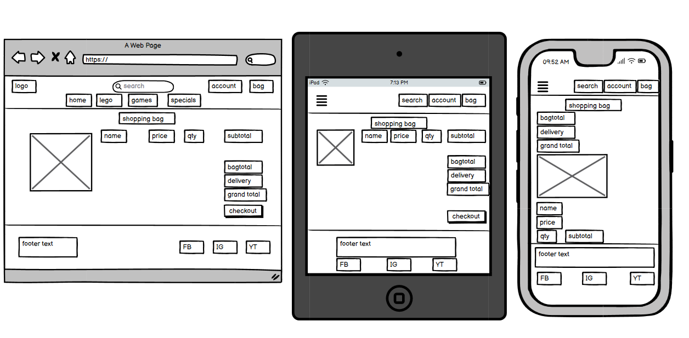
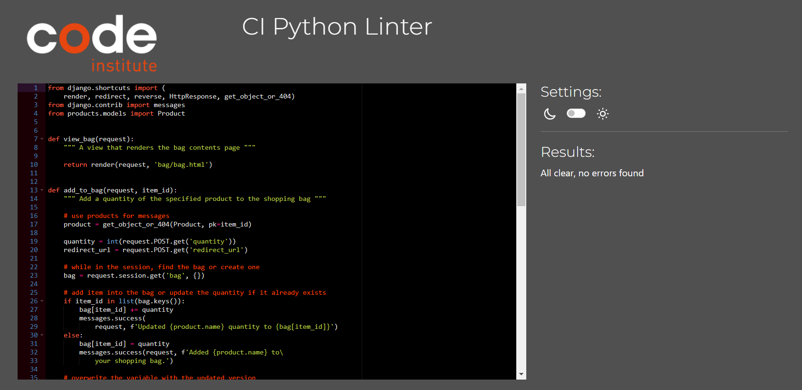

# FORKIDS

[Visit the website here](https://for-kids-1eb46f197086.herokuapp.com)


This project was created as a web app application using Python within Django framework, ElephantSQL as a relational database system, Amazon Web Services, Stripe payment platform, Heroku cloud platform and more. The whole development proccess has been made using cloud IDE called CodeAnywhere. The project was made for educational purposes only.

The business goals for this website are:

1. To boost the ForKids brand awareness
2. To get more leads
3. To build a database of users - current and possibly future customers
4. To increase sales

The user goals for this website are:

| As a/an...      | I want to be able to...                          | so that I can...                                                             |
| --------------- | ------------------------------------------------ | ---------------------------------------------------------------------------- |
| website visitor | view products                                    | select one to buy                                                            |
|                 | check every individual product details           | identify the price, description, product rating or image                     |
|                 | see the total cost of my shopping at any time    | avoid spending too much                                                      |
|                 | sort the products                                | easily identify the best rated, best priced or categorically sorted products |
|                 | search for a product by a name or description    | find a specific product                                                      |
|                 | view items that I want to buy in my bag          | check the total cost and all selected products                               |
|                 | adjust the quantity of items in my bag           | easily make changes before checkout                                          |
|                 | safely enter my payment and personal information | checkout quickly without any problems                                        |
|                 | view an order confirmation after checkout        | verify that I have not made any mistakes                                     |
|                 | receive an email confirmation after checking out | keep the confirmation of the purchase                                        |
| site user       | easily register for an account                   | have a personal profile                                                      |
|                 | login, logout, or recover my password            | access or recover my personal account information                            |
|                 | have a personalized user profile                 | view my order history or order confirmations                                 |
| administrator   | add products                                     | add new items to my store                                                    |
|                 | edit a product                                   | change product information                                                   |
|                 | delete a product                                 | remove items that are no longer for sale                                     |
|                 | check list of completed orders and users         | have a feedback of the website processes                                       |

## UX

### **Strategy**

Considering the core UX principles, as first I started to think about the strategy for this project and defined who the target users would be and what features/technologies they would want.

ForKids target users are kids, adults, parents or collectors. Anyone who loves toys in general and would like to buy them.

And now the question is - what would be these users looking for? The answers I found were:

- Clear navigation which is easy to follow
- Good looking design which makes the website look desirable
- Possibility to register, login and create the profile
- View products and sort them through multiple options, such as price or rating
- View products details
- Possibility to search through products
- Pay safely for products in a shopping bag
- Get a confirmation of their purchase
- Access to social media links to follow the news

This project has been built to offer all of the named things. An extra effort was taken to provide an intuitive interaction for every user visiting the webpage.

### **Scope**

To achieve the desired user and business goals, the following features will be included in this release:

- 'Home' page with logo, navigation panel and search bar, hero image with information, call up button to check the available products, and also including the footer with social media links as well
- 'Products' page where the user can search through the shop by the navigation panel, search bar or sorting options
- Every product has it's details page which contains information such as category, rating, image, description. It can be opened upon clicking on the product
- The product detail includes the button 'Add to Bag' which will add the product to the shopping bag of the user
- 'Shopping Bag' page which shows the chosen products to buy, their price, delivery costs and the grand total
- 'Checkout' page which contains form to fill with the customer information, order summary and payment form
- 'Confirmation' page which shows up after the checkout was successfully done with order summary and confirmation
- 'Profile' page where users can save their delivery information for faster shopping and check order history
- 'Product management' page for an admin only to add products

### **Structure**

The app's Back End has been built by Python using Django framework because it's flexible and less time-wasting. All data are getting saved into PostgreSQL using ElephantSQL database system and fully accessible through the provided dashboard. Connection to the database has been coded through Python.

The website is made up of multiple apps using Django MTV method = Models, Templates and Views. Each built page has it's own app.
It's important to mention that I used Bootstrap for its design principles and grid system to make sure that responsiveness is on point.

A special user 'admin' can access the Django admin page, where he can add, edit or delete any category or product. He has also a possibility to see the users information, such as their profile name or email address.

All important actions give feedback to the user in the form of messages, for example after registration, adding a product or signing in.

With help of Django, it was easier to implement the logic part of this project and it's clearly visible in examples like checkout where a user can have his details already loaded from profile, or in 'My Profile' page where he can find his order history and upload the information needed for completing the order.

### **Skeleton**

This project is about the Full Stack development - so I decided to focus not only on the Back End and logic part of the website, but Front End as well and tried to built as good looking page as possible.

I intentionally used 'base' template method built in Django to work faster and to be sure each page contains the same content in Navbar or Footer. The pages were generated by using templates in each app, so for example in the app called products the template is used to generate a webpage for each product details. I also customized CSS styling to make interaction with this web application handy, for example with text styling, shadow and hovering effects on buttons, product design and checkout page.

Last but not least, I worked on responsiveness to allow users to use the webpage on different devices without any additional errors. Creating something responsive is integral to the design. I felt that all mentioned above helps to provide the best User Experience and highlight the purpose of this project.

### Color Scheme

I chose a color palette based around white & black as these colors are elegant and simple to implement into the design. I added green colors for buttons and headings. Additionally, I chose to use other colors for hover effects and box shadowing, however the main palette has been around these colors:

- `#000000` used for primary text or background
- `#ffffff` used for secondary text or background
- `#4B8351` used for primary highlights
- `#787F7E` used for secondary highlights

The colours have been mainly used with help of Bootstrap framework.


### Typography

I decided to use Google font 'Lato' with different font weights throughout the project thanks to its elegance. I left the font 'sans-serif' as a backup font style if anything goes wrong with the Google link. Secondly, I used the Google font 'Metal Mania' for the logo of the website. Last but not least, the Font Awesome icons were used throughout the site, such as the social media icons in the footer.

- [Lato](https://fonts.google.com/specimen/Lato)

- [Sans-serif](https://fonts.google.com/knowledge/glossary/sans_serif)

- [Metal Mania](https://fonts.google.com/specimen/Metal+Mania)

- [Font Awesome](https://fontawesome.com)

## Wireframes

To follow the best practices, wireframes were developed for mobile, tablet, and desktop sizes. I've used [Balsamiq](https://balsamiq.com/wireframes) to design my page wireframes.

| Page | Screenshot |
| --- | --- |
| Home Page |  |
| Products Page |  |
| Shopping Bag Page |  |

## Features

### Existing Features

- **Home Page**

'Home Page' contains the navigation menu on the top with the logo, searchbar for the user to use, links to the account and shopping bag. I decided to use the hero image with call-to-action button in the middle that opens the products page. As the last piece, there is the footer on the bottom of the page which contains the social media links.


- **Searchbar**

In the middle of the navigation panel (when using desktop view, otherwise as an icon shown in the next feature) is placed the search bar which is meant to help people to search through the products on the webpage. In the example below, I tried to find the 'cards' and it showed me the result with cards as the product/category name or in description.


- **Navigation Panel**

As part of the responsive design, I have to be sure that the navigation is always visible and accessible to the user. That's why I used the dynamic navbar from Bootstrap. It follows the chosen UX principles and adds a nice touch when the user uses a smaller device. The best point is that all the features remains accessible to the user at anytime.


- **Products Page**

'Products Page' contains all off the products available for the user to buy. The products can be sorted either by category using the navigation menu, or by price, rating, name and category using the built in 'Sort by..' element on the left side. Each product shows image and information such as name, rating, price and category. The admin has a special option to either Edit or Delete each product via the special buttons visible only to him when signed in.


- **Product Details Page**

'Product Details Page' opens after clicking upon the product on the Products Page. That's the place where the user can get even more information about the product by reading the description and get the product to the shopping bag. An extra button 'Keep Shopping' is provided to get the user easily back to the products browsing.


- **Messages**

The messages are generated by Python and provide additional feedback to the user interaction, for example after adding a product to the shopping bag, successful checkout order or registration. They are always under the navigation panel to make sure they are visible either for desktop or phones.

In the screenshot below, I have added the product to the shopping bag and the message was generated. It shows me which product I added, how much more I could spend to get a free delivery and if I want to go to a secure checkout. This part was created mostly for the users comfort and to guide him through the shopping experience.


- **Shopping Bag Page**

'Shopping Bag Page' contains all users chosen products, their images, prices and quantities. This page can be opened by clicking on the Shopping Bag logo in the navigation menu (highlighted by different boldness and color via CSS), or by clicking to 'Secure Checkout' on the Products details page/message window.

I have added an option to either 'Update' the quantity or 'Remove' the product from the shopping bag if the user want to do so. It is clearly visible how much is the purchase, delivery costs(if applied) and the grand total. Again, an extra button 'Keep Shopping' is provided to send the user back to products page.


- **Checkout Page**

'Checkout Page' is divided into two parts. One part contains the users details, his name, email address (where the confirmation will be sent) and delivery information. By the way, this information can be set up in the My Profile page which will be shown in an additional feature. I have decided to implement this solution to give the user an option to buy products faster without repeating the process of writing the same information into the form. Second part contains the order summary - the same as in the Shopping Bag Page.

After filling the form and adding the payment details, the order is completed. If all runs smoothly, I should see the payment in the Stripe dashboard and the order in the django admin page.


- **Webhook Handler**

A webhook is an HTTP endpoint that receives events from Stripe. Webhooks allow me to be notified about payment events that happen in the real world outside of my payment flow. For example, if the payment goes wrong because of insufficient fund or lost connection, I will be notified and the order will be cancelled.

After completing the order, the user should see the loading overlay for a few seconds. That's the time needed to connect two applications and make sure all is verified.


- **Order Confirmation Page**

As explained above, when everything runs good and without any interuptions, order will be completed and the order confirmation will be created. On this page, the user can see the special order number, order date and order summary. As well, the message is created to send an additional feedback to the user. By the way, the same order confirmation will be accessible when user is logged in. It will get saved into his My Profile page so he could find the order confirmation whenever needed.

I add another screenshot that shows our test purchase has been verified by Stripe.


- **Sign In Page**

When the user is already registered, he can sign in using this page. The path for signing in goes through My Account button in the navigation panel.


- **Sign Up Page**

This is page where users can register in order to create the profile on our webpage. All the program need is e-mail address, chosen username and password. The user should get notification e-mail to verify their e-mail address.


- **Profile Page**

As mentioned above, 'Profile Page' contains two sections of delivery information and order history. The delivery information can be either updated here and saved for future, or saved while completing an order and it will be saved automatically. The order history is created to get access to order confirmations.


- **Product Management Page**

'Product Management Page' works only for the admin user and it's a part of CRUD functionality - Create, Read, Update and Delete. Here the admin can Create - Add a product to the store. The Read part is available on the products page, Update and Delete too.


- **Django Admin**

The Django admin application can use my models to automatically build a site area that I can use to create, view, update, and delete records. This saved me a lot of time during development, made it very easy to test my models and got a feel for whether I have the right data.

In the example below, I could easily find the order created while writing this Features part of README file. I can also access e-mails, users, create groups, add or update products, create a new category etc. This is probably the best part of Django.


- **Favicon**

As a rule of thumb, I added the Favicon which relates to the topic of the project.


- **404/500 Error Message**

When anything goes wrong with the links, server or website, the 404/500 page pops up to make sure it leads users to the 'Home Page' by clicking on the button. Alternatively, users can use the navigation panel to visit another part of the website.


### Future Features

- **Upload more Products**

There is many ways how to improve the product base. It's not only about quantity, but adding hot products with a good marketing could be the best move. I believe that with more developing time I could play with recommended products, top rated, today's deals and so on.

- **Improve UX/UI**

The whole design is currently on point. It has been developed in a simple way to work properly on any screen sizes. However, every good e-commerce project could be improved with advance reactJS framework by adding improved layout. This is a must!

- **Adding necessary documentation**

If I sell products or services online, my ecommerce business must include the legal documents like an up-to-date, easy to find and easily accessible Privacy Policy. a Cookie Policy (if I use cookies) a Terms and Conditions document. It's necessary to add them before getting really into business.

I am also wondering about ideas with e-mail marketing or creating a blog using Django CMS.

## Tools & Technologies Used

- [HTML](https://en.wikipedia.org/wiki/HTML) used for the main site content
- [CSS](https://en.wikipedia.org/wiki/CSS) used for the main site design and layout
- [JavaScript](https://en.wikipedia.org/wiki/JavaScript) used for user interaction on the site
- [Python](https://www.python.org) used as the back-end programming language
- [Django](https://www.djangoproject.com) used as the Python framework for the site
- [Git](https://git-scm.com) used for version control (`git add`, `git commit`, `git push`)
- [GitHub](https://github.com) used for secure online code storage
- [Heroku](https://heroku.com) used for hosting the deployed back-end site
- [CodeAnywhere](https://codeanywhere.com) used as a cloud-based IDE for the development
- [Bootstrap](https://getbootstrap.com) used as the front-end CSS framework for modern responsiveness and pre-built components
- [Font Awesome](https://fontawesome.com/) used to obtain the media icons
- [Google Fonts](https://fonts.google.com/) used to obtain the fonts linked in the header and used in the project
- [Google Developer Tools](https://developers.google.com/web/tools/chrome-devtools) used as a primary method of fixing spacing issues, finding bugs, and testing responsiveness across the project
- [Grammarly](https://www.grammarly.com/) used to fix the thousands of grammar errors across the project
- [Coloors](https://coolors.co/) used to create a color palette for the design
- [W3C Markup Validation Service](https://validator.w3.org/) used to validate all HTML code written and used on this webpage
- [W3C CSS Validation Service](https://jigsaw.w3.org/css-validator/#validate_by_input) used to validate all CSS code written and used on this webpage
- [JSHint](https://jshint.com/) used to validate all JS code written and used on this webpage
- [PEP8 CI Python Linter](https://pep8ci.herokuapp.com) used to validate all of my Python files
- [Lucid](https://www.lucidchart.com/pages/examples/er-diagram-tool) used to design the database ER diagram
- [Balsamiq](https://balsamiq.com/wireframes) used to design the wireframes
- [PostgreSQL](https://www.postgresql.org) used as the relational database management
- [ElephantSQL](https://www.elephantsql.com) used as the Postgres database
- [Stripe](https://stripe.com) used for online secure payments of ecommerce products/services
- [AWS S3](https://aws.amazon.com/s3) used for online static file storage
- [Pexels](https://www.pexels.com) used to download the needed media

## Media

| Source                                                                | Location    | Type             | Notes                |
| --------------------------------------------------------------------- | ----------- | ---------------- | -------------------- |
| from [Pexels](https://www.pexels.com)                                 | entire site | image            | favicon on all pages |
| [Pexels](https://www.pexels.com/photo/toy-military-vehicles-5257289/) | home page   | background image | hero image           |

## Database Design

Entity Relationship Diagrams (ERD) help to visualize database architecture before creating models. Understanding the relationships between different tables can save time later in the project. Here is one example of created model and shown it's data in the table:

```python
class Product(models.Model):
    category = models.ForeignKey(
        "Category", null=True, blank=True, on_delete=models.SET_NULL)
    sku = models.CharField(max_length=254, null=True, blank=True)
    name = models.CharField(max_length=254)
    description = models.TextField()
    price = models.DecimalField(max_digits=6, decimal_places=2)
    rating = models.DecimalField(
        max_digits=6, decimal_places=2, null=True, blank=True)
    image_url = models.URLField(max_length=1024, null=True, blank=True)
    image = models.ImageField(null=True, blank=True)

    def __str__(self):
        return self.name
```

- Table: **Product**

  | **PK** | **id** (unique) | Type         | Notes                    |
  | ------ | --------------- | ------------ | ------------------------ |
  | **FK** | category        | ForeignKey   | FK to **Category** model |
  |        | sku             | CharField    |                          |
  |        | name            | CharField    |                          |
  |        | description     | TextField    |                          |
  |        | price           | DecimalField |                          |
  |        | rating          | DecimalField |                          |
  |        | image_url       | URLField     |                          |
  |        | image           | ImageField   |                          |

I have used [Lucidchart](https://www.lucidchart.com/) to design my site ERD. The entire data schema is shown in the screenshot below:


# Testing

I used the Google Developer Tools to test the website and its layout. This allowed me to check the responsiveness of the site and quickly debug any issues that I came across.

## Code Validation

I have used the recommended [HTML W3C Validator](https://validator.w3.org) to validate my HTML files. However, I have had a problem with this task..

Python uses Jinja syntax, such as ``, ``, and `{{ variable|filter }}`, and they will not validate properly if I am copying/pasting into the HTML validator. To properly validate HTML pages with Jinja syntax, I have to use **View Page Source** on each webpage and validate by inputting the entire compiled code.

Even this approach gets some warnings, but most of them were caused by Bootstrap or Jinja template.

| Page | Screenshot | Notes |
| --- | --- | --- |
| Home Page |  | |
| Products Page |  | |
| Shopping Bag Page |  | Few errors caused by Jinja syntax |
| Checkout Page |  | Few errors caused by Jinja syntax |
| Profile Page |  | |
| Order Confirmation Page |  | |

### CSS

I have used the recommended [CSS Jigsaw Validator](https://jigsaw.w3.org/css-validator) to validate my CSS files.

| File | Jigsaw URL | Screenshot | Notes |
| --- | --- | --- | --- |
| style.css | [Jigsaw](https://jigsaw.w3.org/css-validator/validator?uri=https%3A%2F%2Ffor-kids-1eb46f197086.herokuapp.com%2F&profile=css3svg&usermedium=all&warning=1&vextwarning=&lang=en) |  | Pass with no errors when validated by input. When validated by URI, I am getting too many warnings caused by Bootstrap |
| profile.css | |  | Validated by input |
| checkout.css | |  | Validated by input |

### JavaScript

I have used the recommended [JShint Validator](https://jshint.com) to validate all of my JS files.

| File | Screenshot | Notes |
| --- | --- | --- |
| JS in products.html |  | Pass with no errors |
| JS in bag.html |  | Pass with no errors |
| countryfield.js |  | Pass with no errors |
| stripe_elements.js |  | Undefined Stripe variable |

### Python

I have used the recommended [PEP8 CI Python Linter](https://pep8ci.herokuapp.com) to validate the Python files.

| File | CI URL | Screenshot | Notes |
| --- | --- | --- | --- |
| /manage.py | [PEP8 CI](https://pep8ci.herokuapp.com/https://raw.githubusercontent.com/JakBul/ForKids/main/manage.py) |  | Pass with no errors |
| custom_storages.py | [PEP8 CI](https://pep8ci.herokuapp.com/https://raw.githubusercontent.com/JakBul/ForKids/main/custom_storages.py) |  | Pass with no errors |
| /settings.py | [PEP8 CI](https://pep8ci.herokuapp.com/https://raw.githubusercontent.com/JakBul/ForKids/main/ForKids/settings.py) |  | Pass with no errors |
| bag/views.py | [PEP8 CI](https://pep8ci.herokuapp.com/https://raw.githubusercontent.com/JakBul/ForKids/main/bag/views.py) |  | Pass with no errors |
| checkout/webhooks.py | [PEP8 CI](https://pep8ci.herokuapp.com/https://raw.githubusercontent.com/JakBul/ForKids/main/checkout/webhooks.py) |  | Pass with no errors |
| checkout/webhook_handler.py | [PEP8 CI](https://pep8ci.herokuapp.com/https://raw.githubusercontent.com/JakBul/ForKids/main/checkout/webhook_handler.py) |  | Pass with no errors |
| checkout/views.py | [PEP8 CI](https://pep8ci.herokuapp.com/https://raw.githubusercontent.com/JakBul/ForKids/main/checkout/views.py) |  | Pass with no errors |
| checkout/models.py | [PEP8 CI](https://pep8ci.herokuapp.com/https://raw.githubusercontent.com/JakBul/ForKids/main/checkout/models.py) |  | Pass with no errors |
| products/views.py | [PEP8 CI](https://pep8ci.herokuapp.com/https://raw.githubusercontent.com/JakBul/ForKids/main/products/views.py) |  | Pass with no errors |
| products/models.py | [PEP8 CI](https://pep8ci.herokuapp.com/https://raw.githubusercontent.com/JakBul/ForKids/main/products/models.py) |  | Pass with no errors |
| profiles/views.py | [PEP8 CI](https://pep8ci.herokuapp.com/https://raw.githubusercontent.com/JakBul/ForKids/main/profiles/views.py) |  | Pass with no errors |

## Browser Compatibility

I have tested my deployed project on multiple browsers to check for compatibility issues.

| Browser | Screenshot | Notes |
| --- | --- | --- |
| Chrome |  | Works as expected |
| Edge |  | Works as expected |
| Safari (phone) |  | Works as expected |

## Responsiveness

I have tested my deployed project on multiple devices to check for responsivity issues.

| Device | Screenshot | Notes |
| --- | --- | --- |
| Mobile iPhone 13 |  | Works as expected |
| Mobile iPhone 13 |  | Works as expected |
| Mobile iPhone 10 |  | Works as expected |
| Tablet (DevTools) |  | Works as expected |
| Desktop |  | Works as expected |

## Lighthouse Audit

I have tested my deployed project using the Lighthouse Audit tool to check for any major issues.

| Page | Size | Screenshot | Notes |
| --- | --- | --- | --- |
| Home | Desktop |  | No major issues |
| Home | Mobile |  | Issue with cache policy for static files |
| Products | Desktop |  | Lower perfomance because of Jinja Template |
| Products | Mobile |  | Low perfomance because of Jinja Template |

## User Story Testing

| User Story | Screenshot |
| --- | --- |
| As a website visitor, I would like to view products, so that I can select one to buy. |  |
| As a website visitor, I would like to check every individual product details, so that I can identify the price, description, product rating or image. |  |
| As a website visitor, I would like to see the total cost of my shopping at any time, so that I can avoid spending too much. |  |
| As a website visitor, I would like to sort the products, so that I can easily identify the best rated, best priced or categorically sorted products. |  |
| As a website visitor, I would like to search for a product by a name or description, so that I can find a specific product. |  |
| As a website visitor, I would like to view items that I want to buy in my bag, so that I can check the total cost and all selected products. |  |
| As a website visitor, I would like to adjust the quantity of items in my bag, so that I can easily make changes before checkout. |  |
| As a website visitor, I would like to safely enter my payment and personal information, so that I can checkout quickly without any problems. |  |
| As a website visitor, I would like to view an order confirmation after checkout, so that I can verify that I have not made any mistakes. |  |
| As a site user, I would like to easily register for an account, so that I can have a personal profile. |  |
| As a site user, I would like to login, logout, or recover my password, so that I can access or recover my personal account information. |  |
| As a site user, I would like to have a personalized user profile, so that I can view my order history or order confirmations. |  |
| As an administrator, I would like to add products, so that I can add new items to my store. |  |
| As an administrator, I would like to check list of completed orders and users, so that I can have a feedback of the website processes. |  |

## Unfixed Bugs

- There is this bug on the Product Details page for each product where it's possible to press the button minus many times after 0. I tried to implement JavaScript code to not being able to access it when it equals 0 but I couldn't fix it properly.


- The confirmation or verification e-mails from Gmail API are not working at the moment. I have been trying to fix it for two days but could not find a solution. For now, I have setup the " ACCOUNT_EMAIL_VERIFICATION = 'none' " in /settings.py file so the users can use the website without any disturbance when logging in. The order confirmations are visible in the My Profile page for the moment.

There are no other remaining bugs that I am aware of.

# Deployment

The live deployed application can be found on [Heroku](https://for-kids-1eb46f197086.herokuapp.com).

### ElephantSQL Database

This project uses [ElephantSQL](https://www.elephantsql.com) for the PostgreSQL Database.

To obtain your own Postgres Database, sign-up with your GitHub account, then follow these steps:

- Click **Create New Instance** to start a new database.
- Provide a name (this is commonly the name of the project: ForKids).
- Select the **Tiny Turtle (Free)** plan.
- You can leave the **Tags** blank.
- Select the **Region** and **Data Center** closest to you.
- Once created, click on the new database name, where you can view the database URL and Password.

### Amazon AWS

This project uses [AWS](https://aws.amazon.com) to store media and static files online, because of the fact that Heroku doesn't persist this type of data.

Once you've created an AWS account and logged-in, follow these series of steps to get your project connected.
Make sure you're on the **AWS Management Console** page.

#### S3 Bucket

- Search for **S3**.
- Create a new bucket, give it a name (matching your Heroku app name), and choose the region closest to you.
- Uncheck **Block all public access**, and acknowledge that the bucket will be public (required for it to work on Heroku).
- From **Object Ownership**, make sure to have **ACLs enabled**, and **Bucket owner preferred** selected.
- From the **Properties** tab, turn on static website hosting, and type `index.html` and `error.html` in their respective fields, then click **Save**.
- From the **Permissions** tab, paste in the following CORS configuration:

  ```shell
  [
  	{
  		"AllowedHeaders": [
  			"Authorization"
  		],
  		"AllowedMethods": [
  			"GET"
  		],
  		"AllowedOrigins": [
  			"*"
  		],
  		"ExposeHeaders": []
  	}
  ]
  ```

- Copy your **ARN** string.
- From the **Bucket Policy** tab, select the **Policy Generator** link, and use the following steps:

  - Policy Type: **S3 Bucket Policy**
  - Effect: **Allow**
  - Principal: `*`
  - Actions: **GetObject**
  - Amazon Resource Name (ARN): **paste-your-ARN-here**
  - Click **Add Statement**
  - Click **Generate Policy**
  - Copy the entire Policy, and paste it into the **Bucket Policy Editor**

    ```shell
    {
    	"Id": "Policy1234567890",
    	"Version": "2012-10-17",
    	"Statement": [
    		{
    			"Sid": "Stmt1234567890",
    			"Action": [
    				"s3:GetObject"
    			],
    			"Effect": "Allow",
    			"Resource": "arn:aws:s3:::your-bucket-name/*"
    			"Principal": "*",
    		}
    	]
    }
    ```

  - Before you click "Save", add `/*` to the end of the Resource key in the Bucket Policy Editor (like above).
  - Click **Save**.

- From the **Access Control List (ACL)** section, click "Edit" and enable **List** for **Everyone (public access)**, and accept the warning box.
  - If the edit button is disabled, you need to change the **Object Ownership** section above to **ACLs enabled** (mentioned above).

#### IAM

Back on the AWS Services Menu, search for and open **IAM** (Identity and Access Management).
Once on the IAM page, follow these steps:

- From **User Groups**, click **Create New Group**.
  - Suggested Name: `group-forkids` (group + the project name)
- Tags are optional, but you must click it to get to the **review policy** page.
- From **User Groups**, select your newly created group, and go to the **Permissions** tab.
- Open the **Add Permissions** dropdown, and click **Attach Policies**.
- Select the policy, then click **Add Permissions** at the bottom when finished.
- From the **JSON** tab, select the **Import Managed Policy** link.

  - Search for **S3**, select the `AmazonS3FullAccess` policy, and then **Import**.
  - You'll need your ARN from the S3 Bucket copied again, which is pasted into "Resources" key on the Policy.

    ```shell
    {
    	"Version": "2012-10-17",
    	"Statement": [
    		{
    			"Effect": "Allow",
    			"Action": "s3:*",
    			"Resource": [
    				"arn:aws:s3:::your-bucket-name",
    				"arn:aws:s3:::your-bucket-name/*"
    			]
    		}
    	]
    }
    ```

  - Click **Review Policy**.
  - Suggested Name: `policy-forkids` (policy + the project name)
  - Provide a description:
    - "Access to S3 Bucket for forkids static files."
  - Click **Create Policy**.

- From **User Groups**, click your "group-forkids".
- Click **Attach Policy**.
- Search for the policy you've just created ("policy-forkids") and select it, then **Attach Policy**.
- From **User Groups**, click **Add User**.
  - Suggested Name: `user-forkids` (user + the project name)
- For "Select AWS Access Type", select **Programmatic Access**.
- Select the group to add your new user to: `group-forkids`
- Tags are optional, but you must click it to get to the **review user** page.
- Click **Create User** once done.
- You should see a button to **Download .csv**, so click it to save a copy on your system.
  - **IMPORTANT**: once you pass this page, you cannot come back to download it again, so do it immediately!
  - This contains the user's **Access key ID** and **Secret access key**.
  - `AWS_ACCESS_KEY_ID` = **Access key ID**
  - `AWS_SECRET_ACCESS_KEY` = **Secret access key**

#### Final AWS Setup

- If Heroku Config Vars has `DISABLE_COLLECTSTATIC` still, this can be removed now, so that AWS will handle the static files.
- Back within **S3**, create a new folder called: `media`.
- Select any existing media images for your project to prepare them for being uploaded into the new folder.
- Under **Manage Public Permissions**, select **Grant public read access to this object(s)**.
- No further settings are required, so click **Upload**.

### Stripe API

This project uses [Stripe](https://stripe.com) to handle the ecommerce payments.

Once you've created a Stripe account and logged-in, follow these series of steps to get your project connected.

- From your Stripe dashboard, click to expand the "Get your test API keys".
- You'll have two keys here:
  - `STRIPE_PUBLIC_KEY` = Publishable Key (starts with **pk**)
  - `STRIPE_SECRET_KEY` = Secret Key (starts with **sk**)

As a backup, in case users prematurely close the purchase-order page during payment, we can include Stripe Webhooks.

- From your Stripe dashboard, click **Developers**, and select **Webhooks**.
- From there, click **Add Endpoint**.
  - `https://for-kids-1eb46f197086.herokuapp.com/checkout/wh/`
- Click **receive all events**.
- Click **Add Endpoint** to complete the process.
- You'll have a new key here:
  - `STRIPE_WH_SECRET` = Signing Secret (Wehbook) Key (starts with **wh**)

### Gmail API

This project uses [Gmail](https://mail.google.com) to handle sending emails to users for account verification and purchase order confirmations.

Once you've created a Gmail (Google) account and logged-in, follow these series of steps to get your project connected.

- Click on the **Account Settings** (cog icon) in the top-right corner of Gmail.
- Click on the **Accounts and Import** tab.
- Within the section called "Change account settings", click on the link for **Other Google Account settings**.
- From this new page, select **Security** on the left.
- Select **2-Step Verification** to turn it on. (verify your password and account)
- Once verified, select **Turn On** for 2FA.
- Navigate back to the **Security** page, and you'll see a new option called **App passwords**.
- This might prompt you once again to confirm your password and account.
- Select **Mail** for the app type.
- Select **Other (Custom name)** for the device type.
  - Any custom name, such as "Django" or ForKids
- You'll be provided with a 16-character password (API key).
  - Save this somewhere locally, as you cannot access this key again later!
  - `EMAIL_HOST_PASS` = user's 16-character API key
  - `EMAIL_HOST_USER` = user's own personal Gmail email address

### Heroku Deployment

This project uses [Heroku](https://www.heroku.com), a platform as a service (PaaS) that enables developers to build, run, and operate applications entirely in the cloud.

Deployment steps are as follows, after account setup:

- Select **New** in the top-right corner of your Heroku Dashboard, and select **Create new app** from the dropdown menu.
- Your app name must be unique, and then choose a region closest to you (EU or USA), and finally, select **Create App**.
- From the new app **Settings**, click **Reveal Config Vars**, and set your environment variables.

| Key                     | Value                                                                |
| ----------------------- | -------------------------------------------------------------------- |
| `AWS_ACCESS_KEY_ID`     | user's own value                                                     |
| `AWS_SECRET_ACCESS_KEY` | user's own value                                                     |
| `DATABASE_URL`          | user's own value                                                     |
| `DISABLE_COLLECTSTATIC` | 1 (_this is temporary, and can be removed for the final deployment_) |
| `EMAIL_HOST_PASS`       | user's own value                                                     |
| `EMAIL_HOST_USER`       | user's own value                                                     |
| `SECRET_KEY`            | user's own value                                                     |
| `STRIPE_PUBLIC_KEY`     | user's own value                                                     |
| `STRIPE_SECRET_KEY`     | user's own value                                                     |
| `STRIPE_WH_SECRET`      | user's own value                                                     |
| `USE_AWS`               | True                                                                 |

Heroku needs two additional files in order to deploy properly.

- requirements.txt
- Procfile

You can install this project's **requirements** (where applicable) using:

- `pip3 install -r requirements.txt`

If you have your own packages that have been installed, then the requirements file needs updated using:

- `pip3 freeze --local > requirements.txt`

The **Procfile** can be created with the following command:

- `echo web: gunicorn app_name.wsgi > Procfile`
- _replace **app_name** with the name of your primary Django app name; the folder where settings.py is located_

For Heroku deployment, follow these steps to connect your own GitHub repository to the newly created app:

Either:

- Select **Automatic Deployment** from the Heroku app.

Or:

- In the Terminal/CLI, connect to Heroku using this command: `heroku login -i`
- Set the remote for Heroku: `heroku git:remote -a app_name` (replace _app_name_ with your app name)
- After performing the standard Git `add`, `commit`, and `push` to GitHub, you can now type:
  - `git push heroku main`

The project should now be connected and deployed to Heroku!

### Local Deployment

This project can be cloned or forked in order to make a local copy on your own system.

For either method, you will need to install any applicable packages found within the _requirements.txt_ file.

- `pip3 install -r requirements.txt`.

You will need to create a new file called `env.py` at the root-level,
and include the same environment variables listed above from the Heroku deployment steps.

Sample `env.py` file:

```python
import os

os.environ.setdefault("AWS_ACCESS_KEY_ID", "user's own value")
os.environ.setdefault("AWS_SECRET_ACCESS_KEY", "user's own value")
os.environ.setdefault("DATABASE_URL", "user's own value")
os.environ.setdefault("EMAIL_HOST_PASS", "user's own value")
os.environ.setdefault("EMAIL_HOST_USER", "user's own value")
os.environ.setdefault("SECRET_KEY", "user's own value")
os.environ.setdefault("STRIPE_PUBLIC_KEY", "user's own value")
os.environ.setdefault("STRIPE_SECRET_KEY", "user's own value")
os.environ.setdefault("STRIPE_WH_SECRET", "user's own value")

# local environment only (do not include these in production/deployment!)
os.environ.setdefault("DEBUG", "True")
```

Once the project is cloned or forked, in order to run it locally, you'll need to follow these steps:

- Start the Django app: `python3 manage.py runserver`
- Stop the app once it's loaded: `CTRL+C` or `⌘+C` (Mac)
- Make any necessary migrations: `python3 manage.py makemigrations`
- Migrate the data to the database: `python3 manage.py migrate`
- Create a superuser: `python3 manage.py createsuperuser`
- Load fixtures (if applicable): `python3 manage.py loaddata file-name.json` (repeat for each file)
- Everything should be ready now, so run the Django app again: `python3 manage.py runserver`

If you'd like to backup your database models, use the following command for each model you'd like to create a fixture for:

- `python3 manage.py dumpdata your-model > your-model.json`
- _repeat this action for each model you wish to backup_

#### Cloning

You can clone the repository by following these steps:

1. Go to the [GitHub repository](https://github.com/JakBul/ForKids)
2. Locate the Code button above the list of files and click it
3. Select if you prefer to clone using HTTPS, SSH, or GitHub CLI and click the copy button to copy the URL to your clipboard
4. Open Git Bash or Terminal
5. Change the current working directory to the one where you want the cloned directory
6. In your IDE Terminal, type the following command to clone my repository:
   - `git clone https://github.com/JakBul/ForKids.git`
7. Press Enter to create your local clone.

Alternatively, if using Gitpod, you can click below to create your own workspace using this repository.

[](https://gitpod.io/#https://github.com/JakBul/ForKids)

Please note that in order to directly open the project in Gitpod, you need to have the browser extension installed.
A tutorial on how to do that can be found [here](https://www.gitpod.io/docs/configure/user-settings/browser-extension).

#### Forking

By forking the GitHub Repository, we make a copy of the original repository on our GitHub account to view and/or make changes without affecting the original owner's repository.
You can fork this repository by using the following steps:

1. Log in to GitHub and locate the [GitHub Repository](https://github.com/JakBul/ForKids)
2. At the top of the Repository (not top of page) just above the "Settings" Button on the menu, locate the "Fork" Button.
3. Once clicked, you should now have a copy of the original repository in your own GitHub account!

## Credits

| Source                                                            | Location | Notes                                    |
| ----------------------------------------------------------------- | -------- | ---------------------------------------- |
| [Markdown Builder](https://traveltimn.github.io/markdown-builder) | README   | Tool to help generate the Markdown files |
| [Code Institute](https://learn.codeinstitute.net/ci_program/level5diplomainwebappdevelopment) | Entire project | Walkthrough project that helped me to understand the principles of coding a full responsive app in Django using Stripe, Heroku and AWS |

## Acknowledgments

- First and foremost, I would like to thank my Code Institute mentor Rohit for his support throughout the development of this project
- In addition, I would like to thank the [Code Institute Slack community](https://code-institute-room.slack.com) for the moral support
